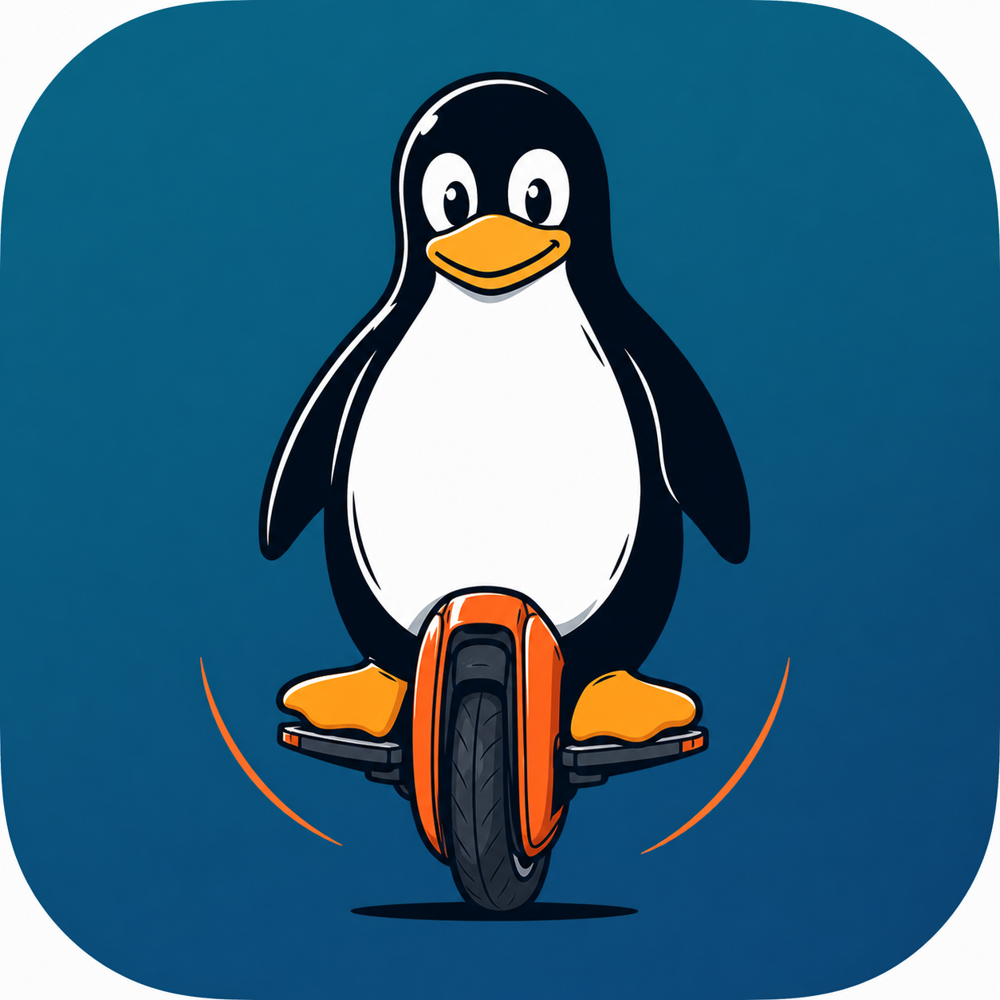

# ADR 002 – Koin as the Sole Dependency Injection Framework



**Date:** 2026-07-17  
**Status:** Accepted  

---

## Context

The project started accumulating two patterns for providing dependencies:
- **Koin** (`org.koin:koin-android`, `koin-androidx-compose`) – used throughout the
  existing codebase for `AppConfig`, `NotificationUtil`, `VolumeKeyController`, and
  `BleSessionViewModel`.
- Ad-hoc singletons accessed via `WheelData.getInstance()` and Kotlin `object`s with
  KoinComponent `inject()`.

The question arose during the dashboard refactoring: should we migrate to **Hilt** (the
Google-recommended alternative) or standardise on Koin?

## Decision

**Retain Koin 4.x as the sole DI framework.**

All new modules (e.g., `dashboardModule`) are registered as Koin modules in `WheelLog.startKoin {}`.

## Rationale

| Factor | Koin | Hilt |
|---|---|---|
| Already adopted | ✅ | ❌ (would require full migration) |
| Annotation processing / KSP | Not required | Required (doubles build time) |
| Compose ViewModel injection | `koinViewModel()` – 1 line | `hiltViewModel()` – needs `@HiltViewModel` annotation on every ViewModel |
| Multiplatform potential | ✅ koin-core is KMP-ready | ❌ Hilt is Android-only |
| Complexity | Low | Higher (generated code, `@EntryPoint`, component graph) |

Migrating to Hilt at this stage would be a large, risky refactor with no clear user-visible benefit.

## Shared BLE session and dashboard injection

`BleSessionViewModel` is an app-wide Koin `single`, not an Activity-scoped
ViewModel definition. Activities, services, and Compose consumers must share the
same BLE session. Resolve it with `by inject()` outside Compose or `koinInject()`
inside Compose, then pass it to `DashboardViewModel` as a Koin parameter.
This matches `BleModule.kt` and `DashboardModule.kt`:

```kotlin
// BLE module
single<BleSessionViewModel> { BleSessionViewModel(androidApplication()) }

// Dashboard module
viewModel { (bleVm: BleSessionViewModel) -> DashboardViewModel(androidApplication(), bleVm, get()) }

// Composable
val bleVm: BleSessionViewModel = koinInject()
val dashVm: DashboardViewModel = koinViewModel { parametersOf(bleVm) }
```

Do not resolve `BleSessionViewModel` through `koinViewModel()` or register it with
`viewModel {}`: ViewModelStore-scoped resolution can create disconnected sessions
for consumers outside that store. `DashboardViewModel` remains a Koin `viewModel`;
only the BLE session is shared application-wide by this pattern.

## Consequences

- All future ViewModels, repositories, and utilities are provided through Koin modules.
- Hilt is not added as a dependency.
- `WheelLog.startKoin {}` is the single place where all modules are registered.
